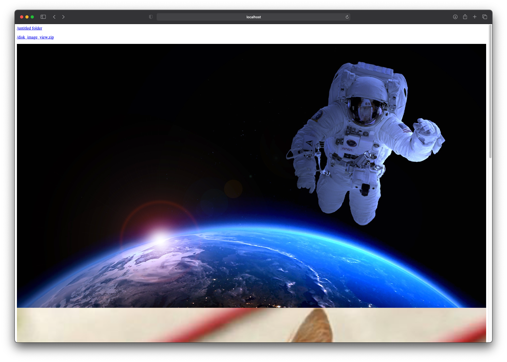

# Disk Image Viewer
一个简单显示磁盘上的图片服务

A simple web service that can view images on the disk.

类似`http-server`和`http.server`，但是把图片直接显示出来而不是给一个链接，方便看远程机器上的图

It's similar to `http-server` and `http.server`, but it displays images in place instead of providing a link. So it's convinient to view images on remote vm. 

## Usage

- install dependencies

`yarn` or `npm install`

- start server

`npm run serve <image_dir_absolute_path>`

- open browser at 

`localhost:5555`

## Screenshot

